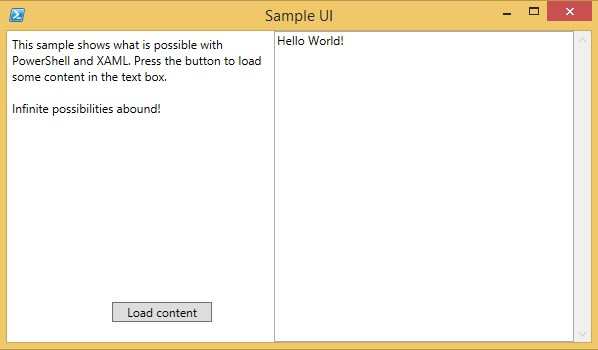

## Show-GUIXaml

This module takes a XAML file to display a window on the screen, and provides variables to be used in events. It uses the WPF assemblies from the Microsoft .NET Framework. By creating XAML files with Visual Studio, some other XAML designer, or by hand, you can create complex GUI interfaces that you can call and handle using PowerShell. The zip also includes a sample file to show how it can be used.

### Usage:

    # Import the module
    Import-Module .\Show-GUIXaml.psm1
    
    # Create the window from a XAML file
    $win1 = Show-GUIXaml -Path .\sample.xaml
    
    # Add event handling
    $button1.add_Click({$textbox1.Text += "Hello World!`n"})
    
    # Assign a value to a control
    $label1.Text = "This sample shows what is possible with PowerShell and XAML. Press the button to load some content in the text box.`n`nInfinite possibilities abound!"
    
    #Launch the window
    $win1.ShowDialog() | out-null

### Example:

